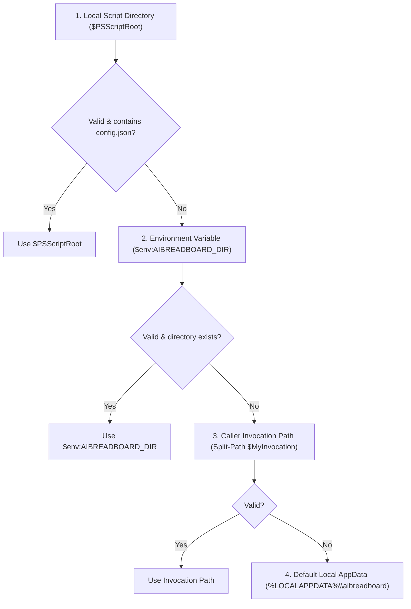

# 📦 AI Breadboard Modular Installation Architecture (`install/`)

## 1. Architectural Overview & Philosophy

The `install/` subsystem is an enterprise-grade, modular setup and lifecycle bootstrapping framework designed for the **`AI Breadboard`** interactive AI platform.

### Core Architectural Principles
1. **Configuration over Hardcode (`install.json`):** No paths, version targets, or repository URLs are hardcoded inside script logic. All operational boundaries are defined in [`install.json`](./install.json).
2. **Single Source of Truth for Project Location (`AIBREADBOARD_DIR`):** The exact installation folder is permanently registered in the user's OS environment (`AIBREADBOARD_DIR` and `ASSIST_DIR`), ensuring that internal components (`header.py`), CLI tools (`scripts/dev/assist_cli.py`), and external agentic harnesses always locate the project root unambiguously.
3. **Decoupled Single-Responsibility Modules:** Each stage of deployment (localization, directory allocation, environment isolation, package resolution, security certificate provisioning, CLI registration, and integrity verification) is encapsulated in an independent script that can be executed or tested in isolation.
4. **Resilient Dual-Mode Execution:** Operates seamlessly both in **remote bootstrap mode** via an interactive one-liner (`irm ... | iex`) and in **local repository mode** (`.\install.ps1`).
5. **Full Multilingual Localization (I18N):** Native support for **Russian (RU)**, **English (EN)**, **Spanish (ES)**, and **Hebrew (HE)** across all dialogs, advisories, and status reports.

---

## 2. Installation Lifecycle Pipeline

The diagram below illustrates the exact execution pipeline and module interaction model:

```mermaid
flowchart TD
    Start(["🚀 Start: irm ... | iex OR .\\install.ps1"]) --> LoadConfig["1. Load Configuration (install/install.json)"]
    LoadConfig --> InitI18n["2. Initialize I18N Engine (Install-I18n.ps1)"]
    InitI18n --> DetectLang["3. Detect System Locale & Prompt Language (RU / EN / ES / HE)"]
    DetectLang --> DirSelect["4. Directory Resolution (Install-Directory.ps1)<br/>• Explain Active Dev Stability<br/>• Confirm Default: %LOCALAPPDATA%\\aibreadboard OR Custom<br/>• Autonomous Git Clone / ZIP Unpack if needed"]
    DirSelect --> Unblock["5. Unblock Project Files (Unblock-File)"]
    Unblock --> Venv["6. Python & Environment Isolation (Install-Venv.ps1)<br/>• Scan Python 3.12-3.14 via py launcher/PATH<br/>• Create/Recreate Isolated venv<br/>• Upgrade pip, setuptools, wheel"]
    Venv --> Deps["7. Dependency Resolution (Install-Deps.ps1)<br/>• Profile: Full / Core / Core+AI / Dev / Skip<br/>• Install via pip"]
    Deps --> Certs["8. Security & SSL Generation (Install-Certs.ps1)<br/>• Validate localhost+2.pem / key<br/>• Invoke install_ssl_cert.ps1 if missing"]
    Certs --> Cli["9. Global System Registration (Install-Cli.ps1)<br/>• Set User Env Var: AIBREADBOARD_DIR & ASSIST_DIR<br/>• Generate assist.ps1, assist.cmd, bash wrapper<br/>• Deploy to %USERPROFILE%\\.local\\bin & Update PATH<br/>• Inject assist function into $PROFILE"]
    Cli --> Verify["10. System Integrity & Verification (Install-Verify.ps1)<br/>• Test Core Python Module Imports<br/>• Persist Language in config.json<br/>• Render Completion Banner"]
    Verify --> Done(["✅ Ready: assist start / ./run.ps1"])
```



---

## 3. Configuration Contract (`install/install.json`)

The entire installation subsystem is driven by [`install.json`](./install.json). Any autonomous agent modifying setup behavior must update this file instead of modifying executable scripts:

```json
{
  "defaults": {
    "language": "ru",
    "install_dir": "%LOCALAPPDATA%\\aibreadboard",
    "venv_dir": "venv",
    "python_min_version": "3.10",
    "python_preferred_versions": ["3.13", "3.12", "3.11", "3.10"],
    "repo_url": "https://github.com/hypo69/AI-Breadboard",
    "repo_zip_url": "https://github.com/hypo69/AI-Breadboard/archive/refs/heads/master.zip",
    "deps_choice": "1"
  },
  "paths": {
    "certs_dir": "%USERPROFILE%\\.certs",
    "cert_file": "localhost+2.pem",
    "key_file": "localhost+2-key.pem",
    "ssl_script": "install_ssl_cert.ps1",
    "secrets_dir": "core\\secrets",
    "gemini_keys_file": "core\\secrets\\gemini_keys.json",
    "env_file": ".env",
    "config_file": "config.json",
    "requirements_main": "requirements.txt",
    "requirements_core": "req\\requirements-core.txt",
    "requirements_ai": "req\\requirements-ai.txt",
    "requirements_test": "req\\requirements-test.txt",
    "requirements_docs": "req\\requirements-docs.txt",
    "local_bin": "%USERPROFILE%\\.local\\bin",
    "assist_ps1": "assist.ps1",
    "assist_cmd": "assist.cmd"
  },
  "env_vars": {
    "AIBREADBOARD_DIR": "",
    "ASSIST_DIR": ""
  },
  "verify": {
    "modules": ["fastapi", "uvicorn", "dotenv", "pydantic", "aiohttp", "cryptography"]
  },
  "supported_languages": ["ru", "en", "es", "he"]
}
```

---

## 4. Module Specifications & Interfaces

### 4.1. `Install-I18n.ps1` (Localization Subsystem)
* **Purpose:** Provides localized string dictionaries and lookup functions for all wizard steps.
* **Exports / Global State:**
  * `$Global:I18N` — Multilingual hashtable indexed by `[ru, en, es, he]`.
  * `$Global:CurrentLang` — Active language code (e.g. `'ru'`).
* **Functions:**
  * `Msg([string]$Key, [object[]]$Args)`: Looks up translation key with fallback cascade (`$Global:CurrentLang` $\to$ `en` $\to$ `ru`). Formats composite tokens `{0}`, `{1}`.
  * `Select-InstallerLanguage([string]$DefaultLang)`: Detects Windows system culture `(Get-Culture).TwoLetterISOLanguageName` and renders an interactive language selection prompt.

### 4.2. `Install-Directory.ps1` (Location & Repository Provisioning)
* **Purpose:** Resolves target deployment directory, presents stability rationale, and provisions repository files.
* **Parameters:**
  * `-Config` *(PSCustomObject)*: Parsed `install.json` object.
  * `-SourceDir` *(string)*: Directory where the installer was launched from (if local).
* **Behavior:**
  1. Displays active development stability explanation:
     > *"Because aibreadboard is under active development, to ensure stability, seamless updates, and reliable tool binding, using the default directory (`%LOCALAPPDATA%\AI Breadboard`) is strongly recommended."*
  2. Prompts user: `[1] Default [Recommended]` or `[2] Custom Path`.
  3. Expands environment tokens (e.g. `%USERPROFILE%`, `%LOCALAPPDATA%`) and validates destination path.
  4. If destination lacks repository files (`header.py`, `config.json`):
     * Copies from current working directory if present.
     * Otherwise, attempts `git clone $repoUrl $targetDir`.
     * If `git` is absent or clone fails, downloads `$repo_zip_url` via `Invoke-WebRequest`, extracts with `Expand-Archive`, and places contents in `$targetDir`.
* **Returns:** `[string]$targetDir` (Full absolute path).

### 4.3. `Install-Venv.ps1` (Python & Virtual Environment Engine)
* **Purpose:** Discovers optimal Python interpreter and creates/repairs isolated virtual environment.
* **Parameters:**
  * `-InstallDir` *(string)*: Target project directory.
  * `-Config` *(PSCustomObject)*: Parsed configuration.
* **Behavior:**
  1. Tests existing `$InstallDir\venv\Scripts\python.exe`.
  2. If absent or corrupt:
     * Iterates through `$Config.defaults.python_preferred_versions` (3.13, 3.12, 3.11, 3.10) using `py -$ver`.
     * Falls back to `python` or `python3` in `PATH` (filtering out WindowsApps broken stub executables).
     * Creates virtual environment: `& $sysPython -m venv $VenvDir`.
  3. Upgrades core package tools: `& $PythonPath -m pip install --upgrade pip setuptools wheel --quiet`.
* **Returns:** `[string]$PythonPath` (Absolute path to `venv\Scripts\python.exe`).

### 4.4. `Install-Deps.ps1` (Dependency Profile Manager)
* **Purpose:** Interactively presents and installs dependency profiles.
* **Parameters:**
  * `-InstallDir` *(string)*: Project directory.
  * `-PythonPath` *(string)*: Venv Python executable.
  * `-Config` *(PSCustomObject)*: Parsed configuration with requirements file paths.
* **Profiles:**
  * `[1]` **Full (Core + AI + Utils)** — Recommended: installs `requirements.txt`.
  * `[2]` **Core only** — installs `req/requirements-core.txt`.
  * `[3]` **Core + AI** — installs `req/requirements-core.txt` and `req/requirements-ai.txt`.
  * `[4]` **Full + Dev (Tests & Docs)** — installs `requirements.txt`, `req/requirements-test.txt`, and `req/requirements-docs.txt`.
  * `[5]` **Skip** — skips package installation.

### 4.5. `Install-Certs.ps1` (SSL Security Subsystem)
* **Purpose:** Validates local HTTPS development certificates.
* **Parameters:**
  * `-InstallDir` *(string)*: Project root.
  * `-Config` *(PSCustomObject)*: Path mappings for certificates.
* **Behavior:** Checks `$env:USERPROFILE\.certs\localhost+2.pem` and `localhost+2-key.pem`. If missing, invokes `install_ssl_cert.ps1`.

### 4.6. `Install-Cli.ps1` (System Environment & CLI Integration)
* **Purpose:** Registers global environment variables, CLI wrapper scripts, and PowerShell profile aliases.
* **Parameters:**
  * `-InstallDir` *(string)*: Fixed project root directory.
  * `-Config` *(PSCustomObject)*: Configuration object.
* **Registrations:**
  1. **User Environment Variables:**
     ```powershell
     [System.Environment]::SetEnvironmentVariable('AIBREADBOARD_DIR', $InstallDir, 'User')
     [System.Environment]::SetEnvironmentVariable('ASSIST_DIR', $InstallDir, 'User')
     ```
  2. **Session Environment Variables:** Sets `$env:AIBREADBOARD_DIR` and `$env:ASSIST_DIR` for current process.
  3. **Wrappers Generated in Project & Deployed to `%USERPROFILE%\.local\bin`:**
     * `assist.ps1`: PowerShell orchestrator calling `scripts.dev.assist_cli` via `$InstallDir\venv\Scripts\python.exe`.
     * `assist.cmd`: Windows Batch wrapper for CMD / non-PowerShell shells.
     * `assist`: Bash wrapper for Git Bash / WSL / MSYS2.
  4. **User PATH:** Appends `%USERPROFILE%\.local\bin` and `$InstallDir` to User `PATH`.
  5. **PowerShell Profile Ingestion:** Injects alias snippet into PowerShell 7 (`Documents\PowerShell\Microsoft.PowerShell_profile.ps1`) and Windows PowerShell 5.1 (`Documents\WindowsPowerShell\Microsoft.PowerShell_profile.ps1`):
     ```powershell
     $env:AIBREADBOARD_DIR = "<InstallDir>"
     function assist { & "<InstallDir>\assist.ps1" @args }
     ```

### 4.7. `Install-Verify.ps1` (Integrity Verifier & State Finalization)
* **Purpose:** Tests runtime module loadability, records settings, and renders completion banner.
* **Parameters:**
  * `-InstallDir` *(string)*: Project root.
  * `-PythonPath` *(string)*: Venv Python.
  * `-Config` *(PSCustomObject)*: Verification rules.
* **Behavior:**
  1. Executes test script importing modules declared in `$Config.verify.modules` (`fastapi`, `uvicorn`, `dotenv`, `pydantic`, `aiohttp`, `cryptography`).
  2. Updates `$InstallDir\config.json` with user setting `"language": "$Global:CurrentLang"`.
  3. Displays final success banner and quick start guidance (`assist start`, `./run.ps1`).

---

## 5. Execution Modes

### Mode A: Remote Web Bootstrap (Zero-Install One-Liner)
```powershell
irm https://raw.githubusercontent.com/hypo69/AI-Breadboard/master/install.ps1 | iex
```
* **How it works:**
  1. The entrypoint `install.ps1` downloads into PowerShell memory.
  2. Dynamically loads `Install-I18n.ps1` and `Install-Directory.ps1` from GitHub raw endpoint.
  3. User selects language and target directory.
  4. Autonomous downloader clones the repo or unpacks `master.zip` into target folder.
  5. Continues executing remaining modules (`Install-Venv`, `Install-Deps`, `Install-Certs`, `Install-Cli`, `Install-Verify`) directly from the local disk.

### Mode B: Local Repository Execution
```powershell
.\install.ps1
```
* **How it works:**
  1. Discovers relative `install/` directory.
  2. Loads `install.json` and invokes modular scripts in sequence.

---

## 6. Internal & External Tools Path Resolution Contract

All runtime scripts and tools in `aibreadboard` resolve the project root using this deterministic priority hierarchy:



### Python Integration (`header.py`)
```python
def set_project_root(marker_files=('__root__', '.git')) -> Path:
    env_dir = os.environ.get("AIBREADBOARD_DIR", "")
    if env_dir:
        env_path = Path(env_dir).resolve()
        if env_path.exists() and (env_path / "config.json").exists():
            if str(env_path) not in sys.path:
                sys.path.insert(0, str(env_path))
            return env_path
    # Fallback to directory tree search
    ...
```

---

## 7. Troubleshooting & Agent Diagnostic Guide

| Failure Symptom | Root Cause | Automated Resolution Action |
|---|---|---|
| `ExecutionPolicy Error` | Windows script execution disabled | Execute `Set-ExecutionPolicy -Scope CurrentUser -ExecutionPolicy RemoteSigned -Force` |
| `Python not found` | No Python 3.10+ in PATH or `py` launcher | Install Python from python.org or winget: `winget install Python.Python.3.13` with PATH enabled |
| `SSL Certificate missing` | Port 443 / 8000 HTTPS errors | Run `.\install_ssl_cert.ps1` from project root |
| `assist command unrecognized` | New terminal hasn't reloaded PATH | Restart PowerShell or run `$env:PATH = [System.Environment]::GetEnvironmentVariable('Path', 'User')` |
| `Target directory write denied` | Permissions error on custom folder | Default to `%LOCALAPPDATA%\AI Breadboard` which is always writable without UAC elevation |
---

## 8. Global CLI Commands (`manage_tools.py`)

After installation, the following commands become globally available from any terminal:

### 8.1 Command Overview

| Command | Description | Example |
|---------|-------------|---------|
| `rag` | RAG index operations | `rag rebuild`, `rag status` |
| `skills` | AI skills catalog management | `skills list`, `skills search media` |
| `knowledge` | Knowledge base management | `knowledge extract --file chat.md` |
| `docs` | Documentation updates | `docs update` |
| `assist` | Assistant process control | `assist start`, `assist stop`, `assist status` |

### 8.2 RAG Commands

```powershell
# Rebuild RAG index from scratch
rag rebuild

# Rebuild with verbose output
rag rebuild --verbose

# Check index status
rag status

# Validate index integrity
rag validate

# Incremental reindex
rag reindex
```

### 8.3 Skills Commands

```powershell
# List all discovered skills
skills list

# Search skills by name or description
skills search media
skills search "database"

# Show full skill prompt/instructions
skills show media-manager

# Export skill as portable JSON contract
skills export db-inspector
skills export db-inspector --without-instructions  # Without markdown
```

### 8.4 Knowledge Commands

```powershell
# Extract knowledge from chat files
knowledge extract --file chat.md
knowledge extract --dir ./chats --recursive

# Add new knowledge entry
knowledge add "New Topic Name"

# Initialize knowledge registry
knowledge init
```

### 8.5 Docs Commands

```powershell
# Update documentation
docs update
```

### 8.6 Assistant Commands

```powershell
# Process management
assist start          # Start assistant in background
assist stop           # Stop running assistant
assist status         # Check assistant status
assist providers      # List configured AI providers
```

---

## 9. Shell Aliases (Installed Automatically)

The installer registers the following aliases in your shell profile:

### Windows PowerShell (`Microsoft.PowerShell_profile.ps1`)

```powershell
$env:AIBREADBOARD_DIR = "C:\Path\To\AI-Breadboard"

function assist { & "$InstallDir\assist.ps1" @args }
function rag { python "$InstallDir\manage_tools.py" rag @args }
function skills { python "$InstallDir\manage_tools.py" skills @args }
function knowledge { python "$InstallDir\manage_tools.py" knowledge @args }
function docs { python "$InstallDir\manage_tools.py" docs @args }
```

### Linux/macOS/WSL (`~/.local/bin/assist`)

```bash
export AIBREADBOARD_DIR="/home/user/AI-Breadboard"

rag() { python "$AIBREADBOARD_DIR/manage_tools.py" rag "$@"; }
skills() { python "$AIBREADBOARD_DIR/manage_tools.py" skills "$@"; }
knowledge() { python "$AIBREADBOARD_DIR/manage_tools.py" knowledge "$@"; }
docs() { python "$AIBREADBOARD_DIR/manage_tools.py" docs "$@"; }
assist() { python -m scripts.dev.assist_cli "$@"; }
```

### Manual Installation (if not using installer)

Add to your shell profile:

**PowerShell** (`~/.config/powershell/Microsoft.PowerShell_profile.ps1`):
```powershell
function rag { python "$env:AIBREADBOARD_DIR\manage_tools.py" rag @args }
function skills { python "$env:AIBREADBOARD_DIR\manage_tools.py" skills @args }
function knowledge { python "$env:AIBREADBOARD_DIR\manage_tools.py" knowledge @args }
function docs { python "$env:AIBREADBOARD_DIR\manage_tools.py" docs @args }
```

**Bash/Zsh** (`~/.bashrc` or `~/.zshrc`):
```bash
rag() { python "$AIBREADBOARD_DIR/manage_tools.py" rag "$@"; }
skills() { python "$AIBREADBOARD_DIR/manage_tools.py" skills "$@"; }
knowledge() { python "$AIBREADBOARD_DIR/manage_tools.py" knowledge "$@"; }
docs() { python "$AIBREADBOARD_DIR/manage_tools.py" docs "$@"; }
```

After adding to profile, reload:
- PowerShell: `. $PROFILE` or restart terminal
- Bash/Zsh: `source ~/.bashrc` or restart terminal