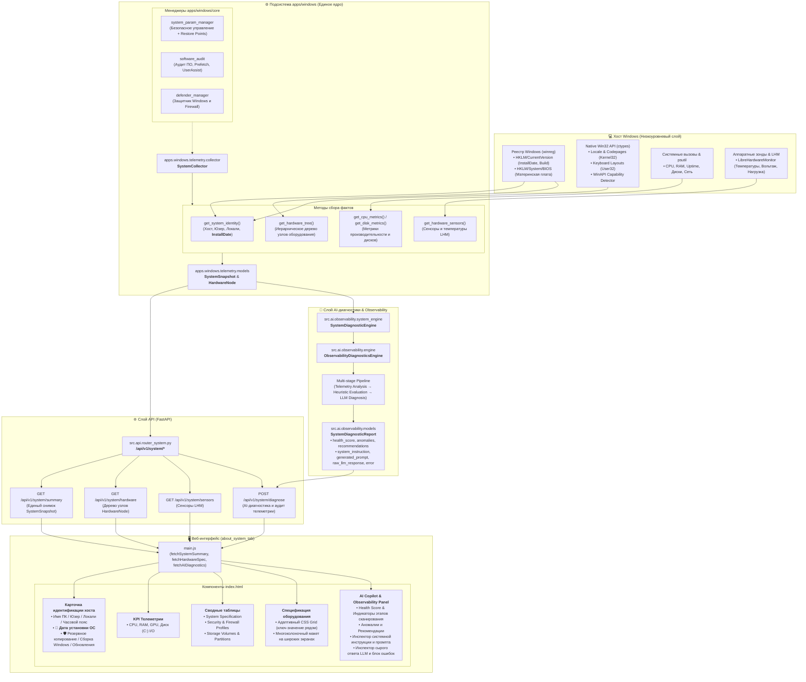

# ℹ️ Вкладка «О Системе» (About System Tab)

Интерактивная панель подробной спецификации оборудования, системной телеметрии и AI-диагностики хоста Windows с поддержкой сквозной наблюдаемости (Observability).

---

## 🏛️ Архитектура и блок-схема потока данных

---

## 📋 Возможности и компоненты интерфейса

1. **Карточка идентификации хоста и региональных параметров**:
   - Имя хоста, имя текущего пользователя и уровень привилегий.
   - Язык интерфейса, локали пользователя и системы (`user_locale`, `system_locale`), кодовые страницы (ACP / OEM).
   - Часовой пояс и раскладки ввода клавиатуры.
   - 📅 **Дата установки ОС** — прямое чтение времени установки Windows из системного реестра (`HKLM\SOFTWARE\Microsoft\Windows NT\CurrentVersion\InstallDate`).
   - Номер сборки Windows и статус установленных исправлений (Windows Update).

2. **Сводные KPI-карточки и живая телеметрия**:
   - Мониторинг загрузки CPU (физические ядра, логические потоки, частота).
   - Оперативная память (RAM занято / свободно, процент использования).
   - Графический ускоритель (GPU модель, объем VRAM, нагрузка, поддержка CUDA / DirectML).
   - Активность накопителя C: (скорость чтения и записи в реальном времени).

3. **Спецификация оборудования (Hardware Tree)**:
   - Иерархическое дерево устройств (System, Processor, Motherboard, Memory, Display, Storage, Network).
   - **Верстка CSS Grid**: свойства отображаются в виде компактной адаптивной двухколоночной сетки (`minmax(140px, 200px) 1fr`), где ключ и значение находятся рядом друг с другом.
   - На широких мониторах список свойств автоматически распределяется по нескольким параллельным колонкам (`repeat(auto-fill, minmax(360px, 1fr))`).
   - Быстрый поиск компонентов и фильтрация на лету.

4. **Износ накопителей и состояние батареи (Storage & Battery Health)**:
   - Мониторинг износа и остаточного ресурса SSD / NVMe (SMART-статус, Health %).
   - Детальная таблица разделов с полосами износа и статусами накопителей.
   - Телеметрия источника питания и деградации аккумулятора ноутбука (Battery Degradation / AC Mains).

5. **Интеллектуальная AI-диагностика и Observability**:
   - Многоэтапный конвейер аудита (*Multi-stage Diagnostic Pipeline*) со статусами выполнения в реальном времени.
   - Расчет индекса здоровья системы (*Health Score 0-100*).
   - Кластеризация и отображение аномалий по уровням важности (Warning, Critical, Info).
   - **Сквозная наблюдаемость (Observability)**:
     - 🛡️ Инспектор системной инструкции модели (*System Instruction Inspector*).
     - 📝 Инспектор сгенерированного промпта (*Sent Prompt Inspector*).
     - 🔬 Инспектор сырого ответа нейросети (*Raw LLM Response Inspector*).
     - ⚠️ Информативный блок ошибок с точной локализацией сбоев провайдеров.

---

## 🔌 API эндпоинты

- `GET /api/v1/system/summary` — получение сводного снимка телеметрии хоста (`SystemSnapshot`).
- `GET /api/v1/system/hardware` — получение иерархического дерева компонентов (`List[HardwareNode]`).
- `GET /api/v1/system/sensors` — сбор показателей сенсоров LibreHardwareMonitor (`List[HardwareSensor]`).
- `GET /api/v1/system/diagnostics/storage-battery` — телеметрия износа накопителей SSD/NVMe (SMART) и батареи питания (`StorageBatteryWearReport`).
- `GET /api/v1/system/processes` — получение списка активных процессов хоста с метриками CPU/RAM.
- `POST /api/v1/system/diagnose` — запуск эвристического и AI-анализа телеметрии (`SystemDiagnosticReport`).
